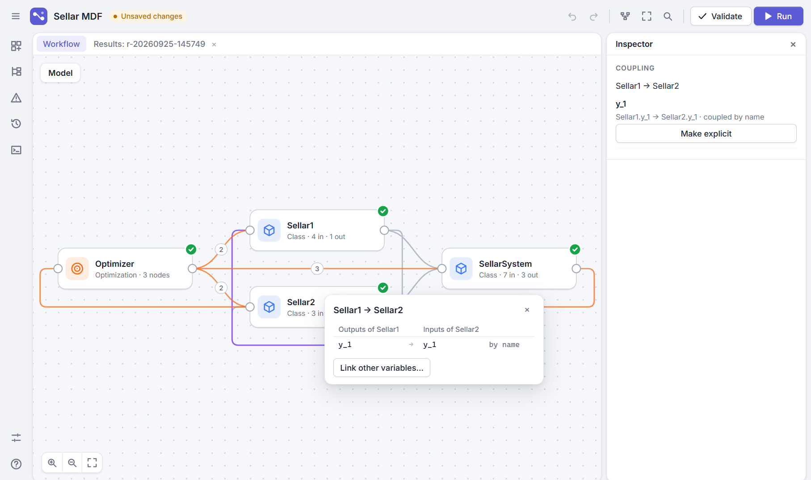
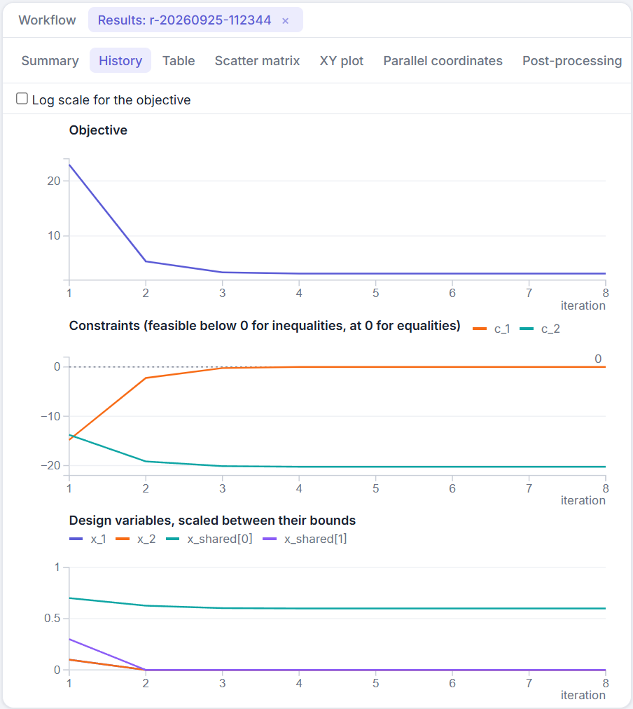
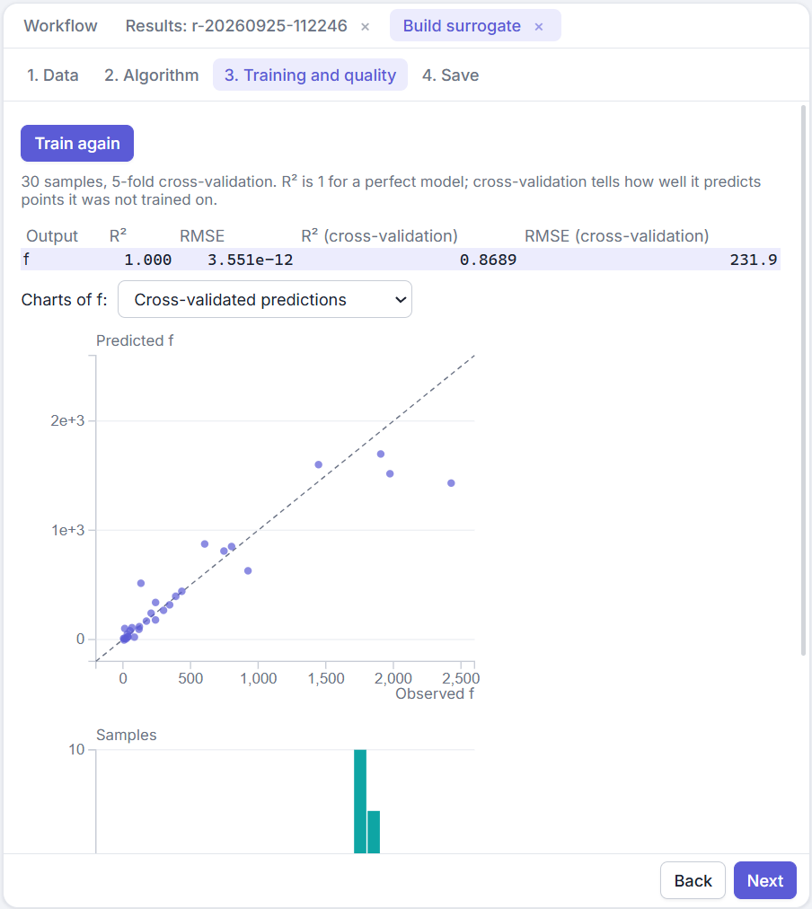

# GEMSEO Process Builder

[](LICENSE)
[](https://github.com/jcdulas/GemseoProcessBuilder/actions/workflows/check.yml)

A desktop application to build, run and analyze [GEMSEO](https://gemseo.readthedocs.io) processes graphically, in the spirit of Ansys ModelCenter.

- Draw a model with components (analytic expressions, Python functions and classes, external codes, surrogate models), assemblies and drivers (MDA, DOE, optimization, parametric study), and link their variables.
- Check it continuously, and look at it as an N2 matrix or an XDSM diagram.
- Run it in a separate process and follow its progress; explore the results with interactive charts and GEMSEO's post-processings.
- Export a readable GEMSEO script, images of every view, and a project report.

> Status: alpha. The file format may still change between versions.



| Results of an optimization | Quality of a surrogate |
|---|---|
|  |  |

## Installation

Python 3.12 or 3.13, on Windows or Linux. The package is not published on PyPI: install it from this repository.

```bash
python -m pip install git+https://github.com/jcdulas/GemseoProcessBuilder.git
gemseo-process-builder
```

Open a project with `gemseo-process-builder model.gpb.json`. The [examples/](examples/) folder has ready-made projects: the Sellar problem with three formulations, Rosenbrock DOE, parametric study and surrogate, the Sobieski BiLevel optimization, a DOE around an optimization, a wing sizing with coupled analytic disciplines, a beam computed by a chain run in order, and an external code.

## Documentation

- [User guide](docs/user_guide.md): building a model, linking variables, drivers, running, results, wrappers, surrogates, exports, shortcuts.
- [Developer guide](docs/developer_guide.md): architecture, protocols, extending the application, tests.
- [Specification](SPEC.md) of the product, and the [plans](plans/) it was built with.
- [Changelog](CHANGELOG.md).

## Development

```bash
python3.12 -m venv .venv
.venv/bin/python -m pip install -e ".[dev]"      # Windows: .venv\Scripts\python.exe
.venv/bin/python tools/check.py                  # ruff, formatting, mypy, pytest, node tests
.venv/bin/python -m gemseo_process_builder --dev # the application, with the DevTools
```

Node.js is needed for the JavaScript tests. No test may last more than one second. See [CONTRIBUTING.md](CONTRIBUTING.md) before opening a pull request.

## License

GEMSEO Process Builder is free software under the [MIT license](LICENSE). It uses third-party components under their own licenses (GEMSEO and Qt for Python under the LGPL, d3, elkjs and others), all listed in [THIRD_PARTY_NOTICES.md](THIRD_PARTY_NOTICES.md).
