# GEMSEO Process Builder

[](LICENSE)
[](https://github.com/jcdulas/GemseoProcessBuilder/actions/workflows/check.yml)

A desktop application to build, run and analyze [GEMSEO](https://gemseo.readthedocs.io) processes graphically, in the spirit of Ansys ModelCenter.

- Draw a model with components (analytic expressions, Python functions and classes, external codes, surrogate models), assemblies and drivers (MDA, DOE, optimization, parametric study), and link their variables.
- Check it continuously, and look at it as an N2 matrix or an XDSM diagram.
- Run it in a separate process and follow its progress; explore the results with interactive charts and GEMSEO's post-processings.
- Export a readable GEMSEO script, images of every view, and a project report.

> Status: alpha. The file format may still change between versions.

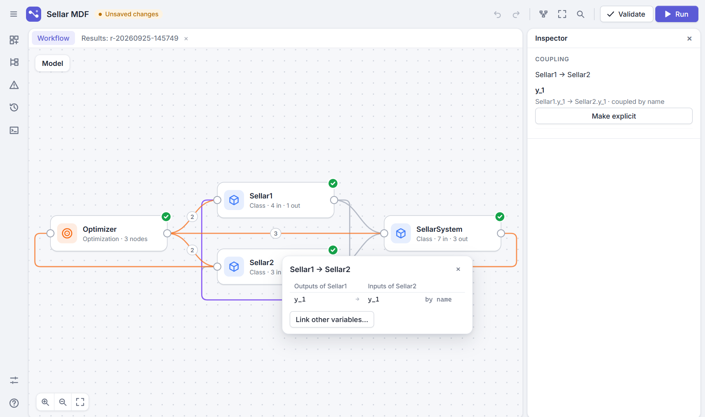

| Results of an optimization | Quality of a surrogate |
|---|---|
| 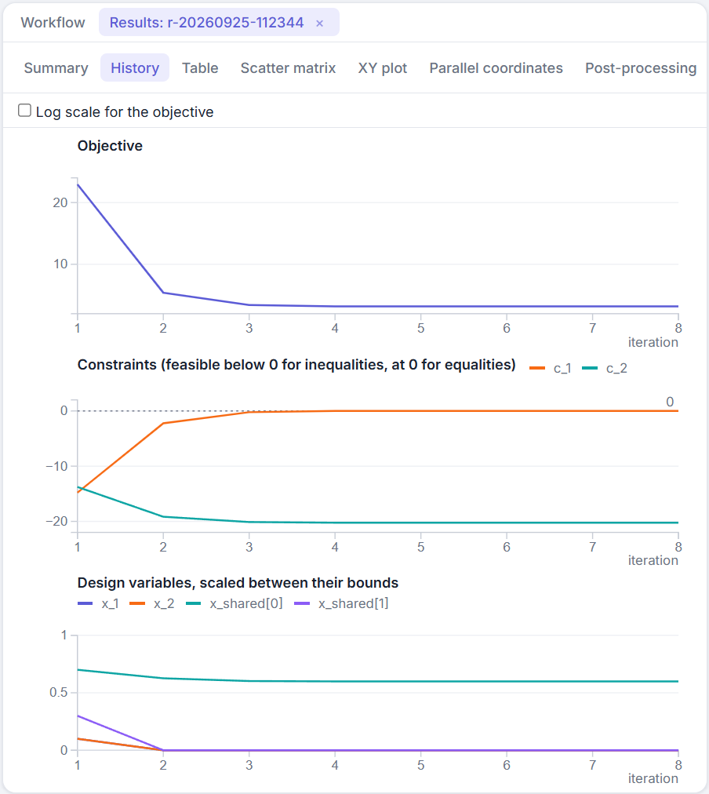 | 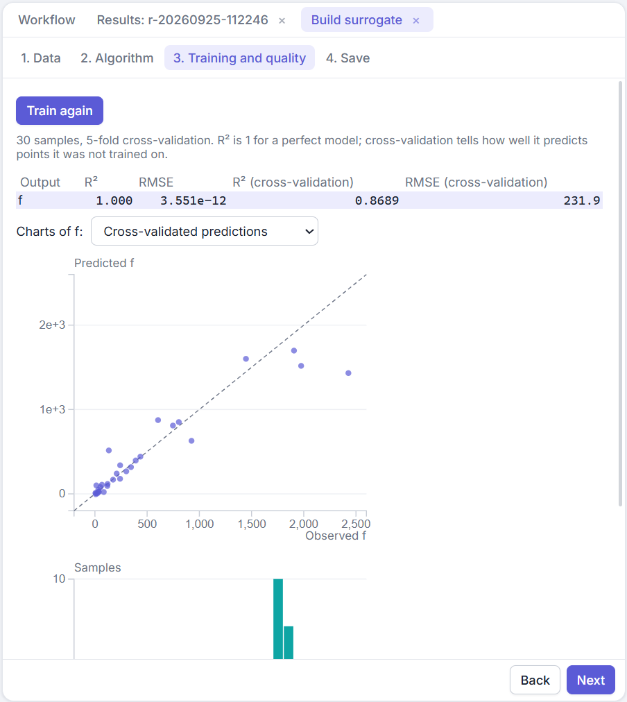 |

## A tour of the interface

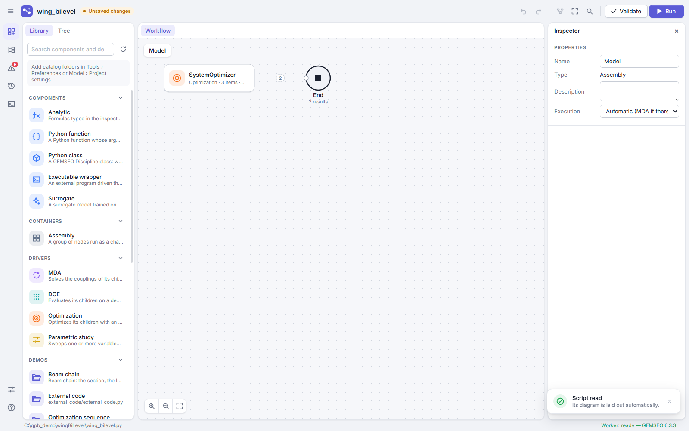

*The workspace, on the bi-level wing sizing described below: the library of components, containers and drivers (left), the workflow canvas (center) and the inspector (right).*

| Every model is a tree of levels | The N2 matrix of a level |
|---|---|
| 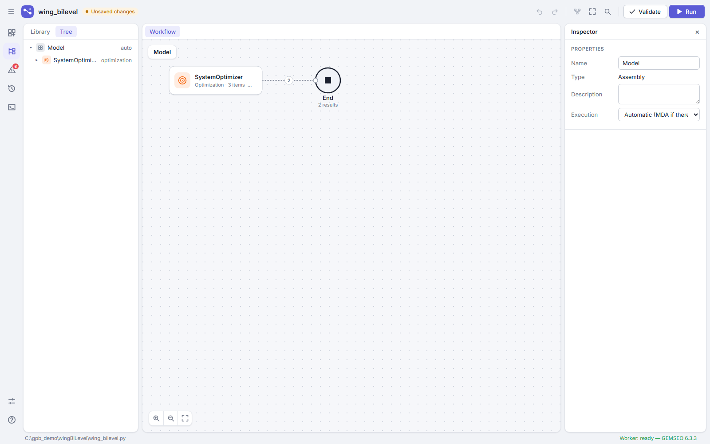 | 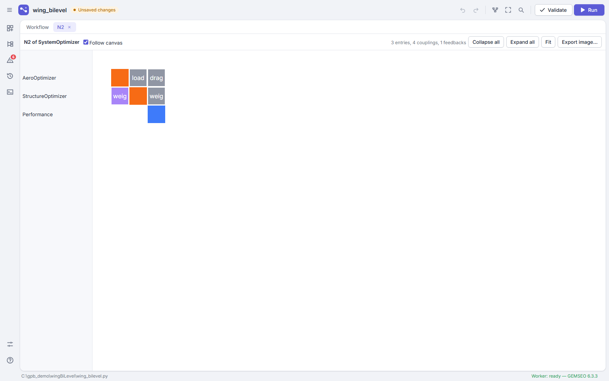 |

| A driver, set up in tabs | Its algorithm, with advice and costs |
|---|---|
| 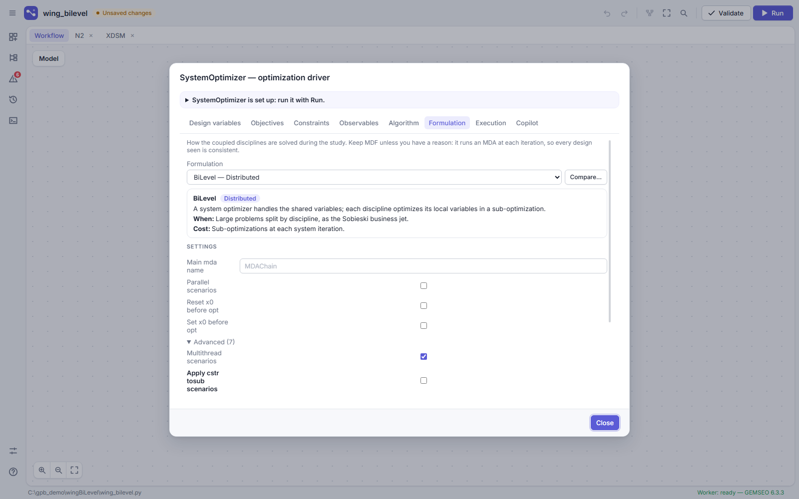 | 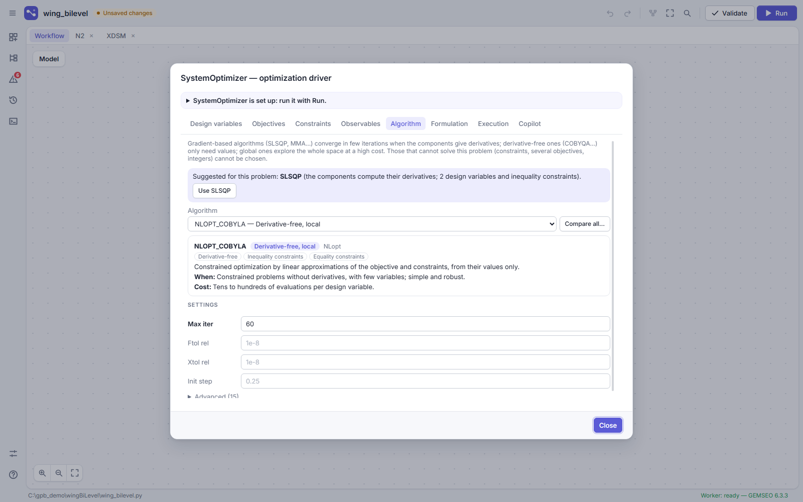 |

## What you can do with it

| Use case | Example project | What the application gives you |
|---|---|---|
| Couple disciplines and optimize | [Sellar](examples/sellar_mdf.py) with MDF, IDF and a disciplinary formulation; [Sobieski](examples/sobieski_bilevel.py) bi-level | The N2 matrix and XDSM of the couplings, the formulation chosen in a list, the history of the objective, the constraints and the design variables |
| Explore a design space | [Rosenbrock DOE and parametric study](examples/rosenbrock_doe.py); [a DOE around an optimization](examples/doe_around_optimization.py) | Samplings, interactive charts, GEMSEO's post-processings |
| Reuse the code you already have | A [chain of Python functions](examples/beam_chain.py), a Python class, an [external program](examples/external_code/) driven through its input and output files | Components wrapped without writing glue code; the generated script shows what runs |
| Replace costly models | A [wing sizing optimized on surrogates](examples/wingBiLevel/), checked against the normal models | Surrogates trained from samples, their cross-validated quality, and the check of the optimum on the model it replaced |
| Go to very many variables | The same wing with [100,000 variables](examples/wingBiLevel100k/), on gradients and post-optimal sensitivities | Runs in a separate process, followed live |
| Size structures under stress constraints | An L-shaped bracket of 10⁴ to 10⁵ plane-stress elements, one von Mises constraint per element (benchmark of [gemseo-lso](plugins/gemseo_lso/)) | The large-scale optimizer, optionally piloted by Claude (below) |
| Test an optimizer against the literature | Trusses of 10, 25 and 72 bars, Svanberg's beam, Hock–Schittkowski problems ([`run_literature.py`](plugins/gemseo_lso/benchmarks/run_literature.py)) | The published optima, reproduced |

## Use case in detail: a bi-level wing sizing

The example [`examples/wingBiLevel`](examples/wingBiLevel/) sizes the wing of an aircraft at three levels: a system level chooses the shape of the wing, and each discipline optimizes its own variable for the shape it is given. The costly models (an aerodynamic and a structural solver) are replaced by surrogates, and the optimum is checked against the normal models. Open it with `gemseo-process-builder examples/wingBiLevel/wing_bilevel.py`: the files are the graph of the study, and the application reads them as a project.

| Level | What it holds | Design variables | Objective |
|---|---|---|---|
| **Model** (the root) | The `SystemOptimizer` and the results of the workflow | | |
| **SystemOptimizer** (a BiLevel optimization) | Two sub-optimizations and the `Performance` component | `area` (10 to 60 m²) and `span` (8 to 30 m) | The range, maximized |
| **AeroOptimizer** | The aerodynamic surrogate | `camber` of the airfoil (0 to 0.12) | The drag, minimized |
| **StructureOptimizer** | The structural surrogate | `thickness` of the wing box | The weight, minimized |

`Performance` computes the range (Breguet's formula) and the wing loading from the weight and the drag; the wing loading is constrained to 3000. The aerodynamics gives its maneuver load to the structure, and the structure gives its weight back: these are the couplings of the N2 matrix and the XDSM below.

| Level 0: the model | Level 1: the system optimization |
|---|---|
| 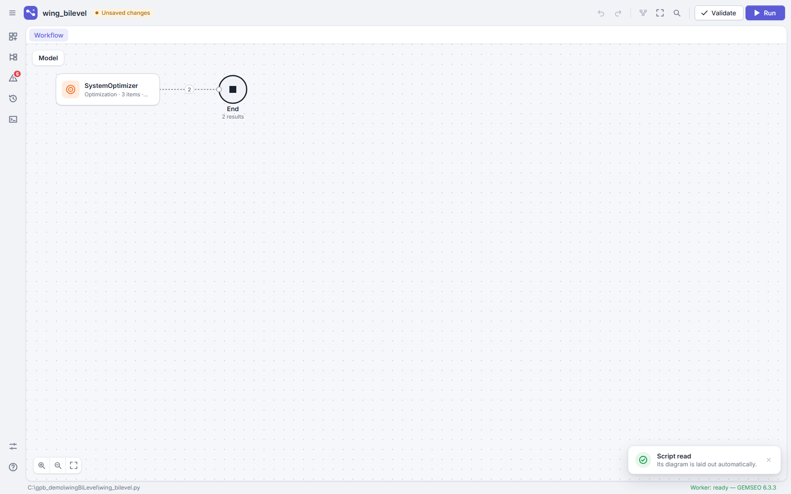 | 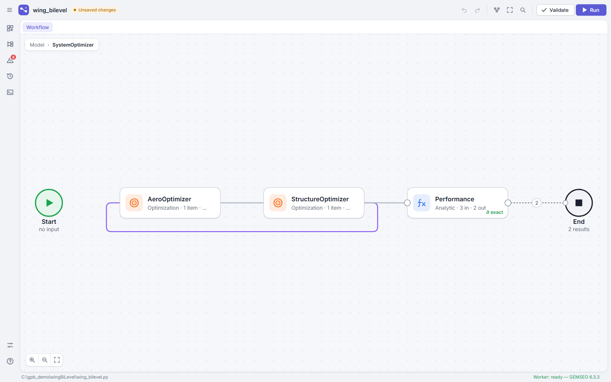 |

| Level 2: the aerodynamics | Level 2: the structure |
|---|---|
| 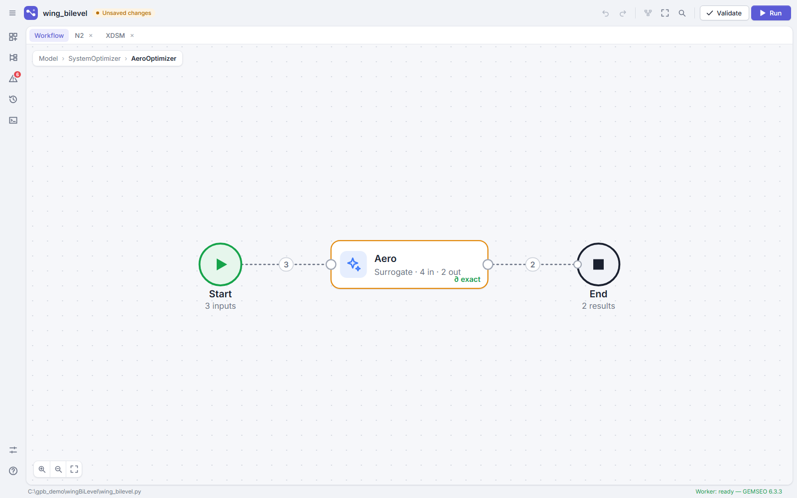 |  |

Double-click a container to go into it; the breadcrumb (*Model › SystemOptimizer › AeroOptimizer*) takes you back up. The XDSM shows the whole process, with its two sub-optimizations (orange) and the MDA loops that solve the couplings (purple):

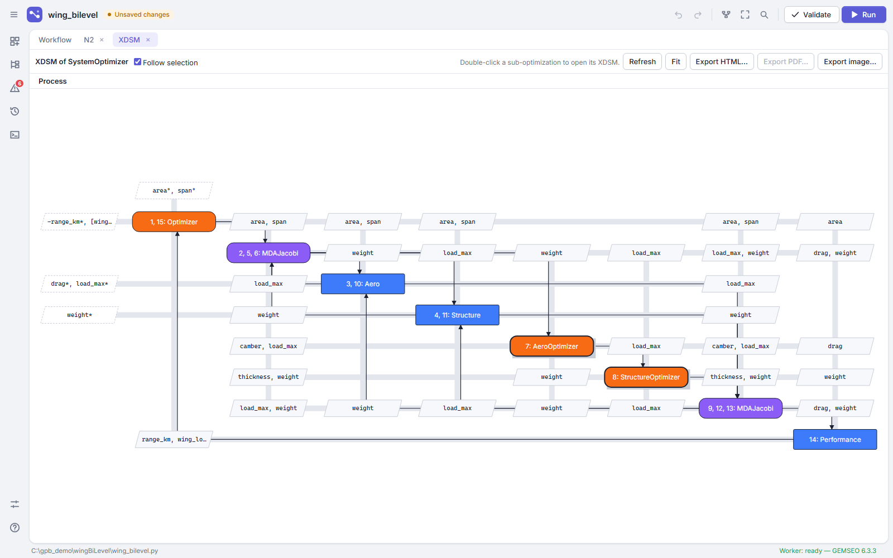

The driver of the system level is set up in tabs: its design variables, then its formulation (BiLevel) and its algorithm (here `NLOPT_COBYLA`, 60 iterations at most):

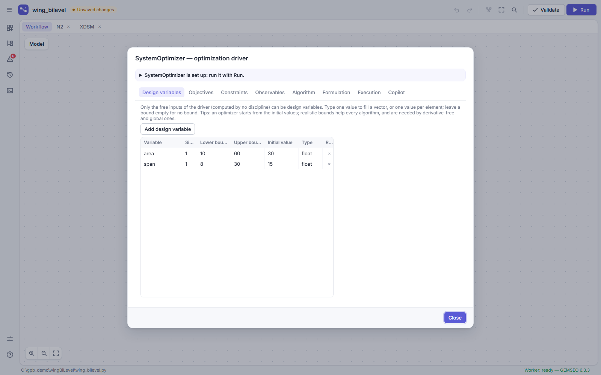

**Run it.** The run starts in its own process and the results tab fills while it goes, with the progress in the status bar and a **Stop** button:

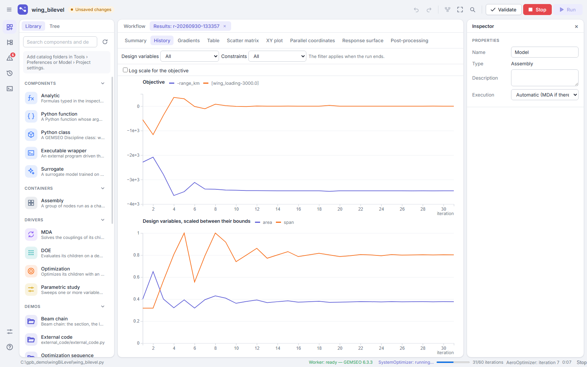

On this machine the run took 1 minute 10 seconds and 46 evaluations. It ends at a range of 3460 km, with `area` 28.81 m², `span` 25.62 m, `camber` 0.05924 and `thickness` 0.1866, the wing-loading constraint active:

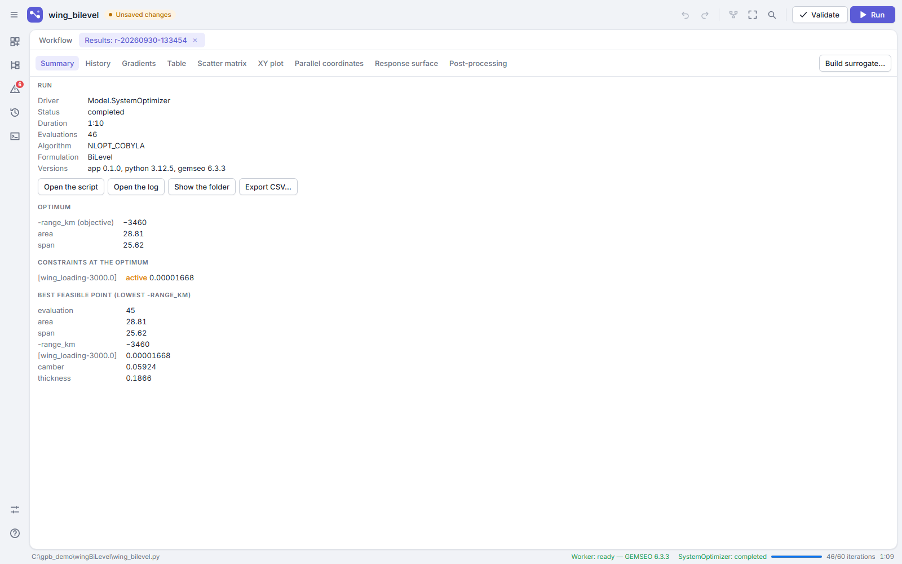

| Parallel coordinates | Response surface of the range |
|---|---|
| 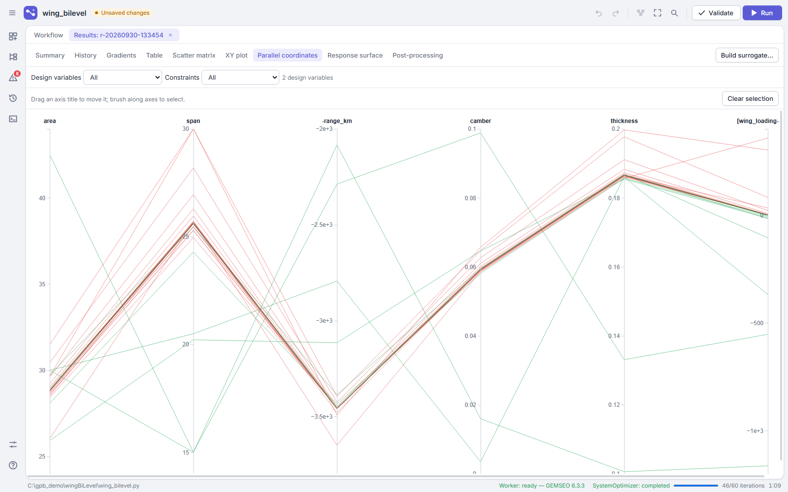 | 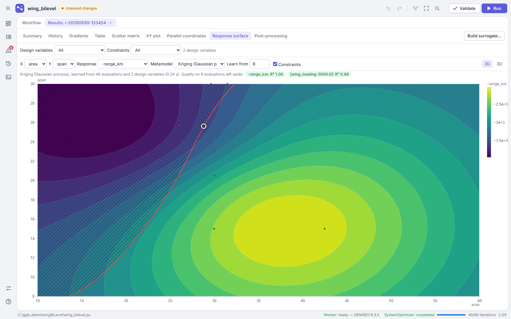 |

The response surface is learned from the evaluations of the run (a Kriging model, 46 evaluations and two design variables, here with an R² of 1.00 for the range and 0.98 for the constraint on the 9 evaluations left aside) and draws the boundary of the constraint; the same data are also in a table, a scatter matrix and GEMSEO's post-processings. The script the run executed is one click away (*Open the script*), and the project is saved as a readable GEMSEO script.

## Installation

Python 3.12 or 3.13, on Windows or Linux. The package is not published on PyPI: install it from this repository.

```bash
python -m pip install git+https://github.com/jcdulas/GemseoProcessBuilder.git
gemseo-process-builder
```

Open a project with `gemseo-process-builder model.py`: projects are saved as readable GEMSEO scripts, and GEMSEO scripts written by hand open as projects. The [examples/](examples/) folder has ready-made projects, as GEMSEO scripts, also opened from the Demos of the Library: the Sellar problem with three formulations, Rosenbrock DOE and parametric study, the Sobieski BiLevel optimization, a DOE around an optimization, a wing sizing with coupled analytic disciplines, a beam computed by a chain run in order, an optimization as a step of a sequence, an external code, a bi-level optimization written by hand in several files, using every kind of component ([examples/demoBiLevel](examples/demoBiLevel/)), a bi-level wing sizing optimized on surrogates checked by their normal models ([examples/wingBiLevel](examples/wingBiLevel/)), and its variant with 100,000 variables, on gradients and post-optimal sensitivities ([examples/wingBiLevel100k](examples/wingBiLevel100k/)).

## Optimization augmented by AI

Two optional packages, installed in the Python that runs your models, work together. Neither is needed to build, run or analyze a process.

### `gemseo-lso`: an optimizer for large problems

[`gemseo-lso`](plugins/gemseo_lso/) adds `LSO_MMA` and `LSO_GCMMA` to GEMSEO: the method of moving asymptotes (Svanberg, 1987 and 2002) for 10⁵ to 10⁶ design variables and as many constraints, whose gradients are costly ([specification](docs/LARGE_SCALE_OPTIMIZER_SPEC.md)). It is written in NumPy, SciPy and Numba and runs one iteration at a time.

- **Working set**: each iteration asks only for the gradients of the constraints close to activity, checks the step against the values of all of them, and solves again when a screened-out constraint would be violated. On the bracket below (10⁴ elements), it reaches the design of the run that asks for every row with about a quarter of the rows (482,288 against 2,000,000).
- **Colored Jacobians** (off by default): for constraints that depend on a few neighbouring variables, a few tens of directional derivatives replace one gradient per constraint.
- **Feasibility**: a run that ends outside its constraints brings itself back within them (smaller steps, GCMMA) and returns the best feasible point it met.
- **Path through the constraints** (`descent_iterations`, off by default): from a neutral start, the design first goes down with soft constraints, toward the lightest design (for a structure, the fully stressed one), then comes back to feasibility.
- **Steppable, with a saved state**: its settings can change between two iterations, the state is saved and resumed exactly, and each report gives the KKT residual, the working set and the variables sitting at a bound.

| With the working set | With every row |
|---|---|
|  |  |

*Stress-constrained L-shaped bracket, 10⁴ elements, `LSO_MMA`: volume fraction 0.3467 with the working set (160 iterations), 0.348 with every row (200 iterations, not converged).*

It was checked on problems with published optima (`plugins/gemseo_lso/benchmarks/run_literature.py`): the 10-, 25- and 72-bar trusses (5060.85, 545.16 and 379.62 lb), Svanberg's beam up to 10⁴ segments, and Hock–Schittkowski 71, 100 and 113. Known limit: on the 10-bar truss, GCMMA from a neutral start lands in the local optimum of 5076.85 lb.

### `gemseo-claude-pilot`: Claude as a copilot of the run

[`gemseo-claude-pilot`](plugins/gemseo_claude_pilot/) lets Claude watch an optimization or a DOE while it runs, explain what happens and act on it ([specification](docs/CLAUDE_PILOT_SPEC.md)). You turn it on in the **Copilot** tab of a driver; the same run works from the generated script, outside the application.

**Who decides.** Three modes: *Observer* (Claude explains, changes nothing), *Advisor* (Claude proposes, you accept or reject) and *Pilot* (Claude applies its decisions). The optimizer never waits for Claude: a decision applies at the next iteration.

**What Claude sees.** The problem (bounds, constraints, algorithm and settings, budget), the history, the report of each outer iteration of `LSO_MMA` and `LSO_GCMMA` (objective, maximum constraint, KKT residual, working set, repairs, step), the symptoms found by simple rules (stagnation, infeasibility, divergence, oscillation, `plateau`, `stuck`, and `frozen`, below), its own earlier decisions and what followed, and how each surrogate was trained. A model whose design lies on a grid can describe its physics: Claude then reads maps of the design, whether the material carries the loads to the supports, and where the stresses concentrate.

**What Claude can do.** Change the settings of the algorithm, narrow the design space, switch algorithm, stop the run, add samples to a DOE, retune a sub-optimization of a bi-level study, steer the design toward where it is heading, or restart it from a transformed design. With the large-scale optimizer, changes of settings, switches between MMA and GCMMA and steering apply at the next iteration, with the asymptotes, multipliers and working set kept.

**Limits and privacy.** Claude never widens your bounds, never spends more evaluations than you allowed, restarts a run at most three times and makes a limited number of calls. Nothing is sent before you accept, and you choose the level: *Anonymized*, *Without code* (the default) or *Full*. It reaches Claude through your Claude Code subscription or an API key (Claude Opus 5.5 at a low effort by default). What is sent goes to Anthropic. Every call, decision and report is kept in a journal, and the run ends with a short report of what happened and how far to trust the result.

**In the application.** The Copilot tab of a driver turns the copilot on and sets its mode, what it may do, the data it may send and its number of calls; the connection and the models are chosen once in the preferences.

| The Copilot tab of a driver | The preferences of the copilot |
|---|---|
|  |  |

**Testing for a local optimum.** The optimizer converges to a local one, and a variable that reached its bound early may have decided which. The reports list the variables at or within 1 % of a bound and what moving them would cost; the `frozen` event fires when the run settles with some; Claude may then lift the cheapest ones with a steering and see whether the run comes back to the same design.

**What we measured.** On the 10-bar truss (published optimum 5060.85 lb), one run for each configuration (the piloted ones with 15 seconds per iteration, so that Claude can answer between two iterations):

| Configuration | Weight (lb) | Claude's decisions |
|---|---|---|
| GCMMA alone, no descent | 5076.67 (local optimum) | none |
| GCMMA alone, descent of 5 iterations | 5060.86 (published optimum) | none |
| Piloted, no descent, first prompt | 5076.67 | 1 |
| Piloted, descent, first prompt | 5060.89 | 4 |
| Piloted, no descent, with the local-optimum test | 5060.88 in one run, 5076.65 in another | 3, then 2 |
| Piloted, descent, with the local-optimum test | 5072.55 (last iterates at 5076.67) in one run, 5060.91 in another | 1, then none |

These are single runs: they show that the descent is what reaches the published optimum most often, and that Claude's test of a local optimum sometimes finds it and sometimes does not. Claude answers in about ten to fifteen seconds, so it cannot steer a run that finishes in less: it is meant for costly simulations, where minutes pass between two iterations.

## Documentation

- [User guide](docs/user_guide.md): building a model, linking variables, drivers, running, results, wrappers, surrogates, exports, shortcuts.
- [Developer guide](docs/developer_guide.md): architecture, protocols, extending the application, tests.
- [Specification](SPEC.md) of the product, and the [plans](plans/) it was built with.
- [Large-scale optimizer](docs/LARGE_SCALE_OPTIMIZER_SPEC.md) and [Claude copilot](docs/CLAUDE_PILOT_SPEC.md) specifications.
- [Changelog](CHANGELOG.md).

## Development

```bash
python3.12 -m venv .venv
.venv/bin/python -m pip install -e ".[dev]"      # Windows: .venv\Scripts\python.exe
.venv/bin/python tools/check.py                  # ruff, formatting, mypy, pytest, JS syntax, node tests
.venv/bin/python -m gemseo_process_builder --dev # the application, with the DevTools
```

Node.js is needed for the JavaScript tests. No test may last more than one second. See [CONTRIBUTING.md](CONTRIBUTING.md) before opening a pull request.

## License

GEMSEO Process Builder is free software under the [MIT license](LICENSE). It uses third-party components under their own licenses (GEMSEO and Qt for Python under the LGPL, d3, elkjs and others), all listed in [THIRD_PARTY_NOTICES.md](THIRD_PARTY_NOTICES.md).
