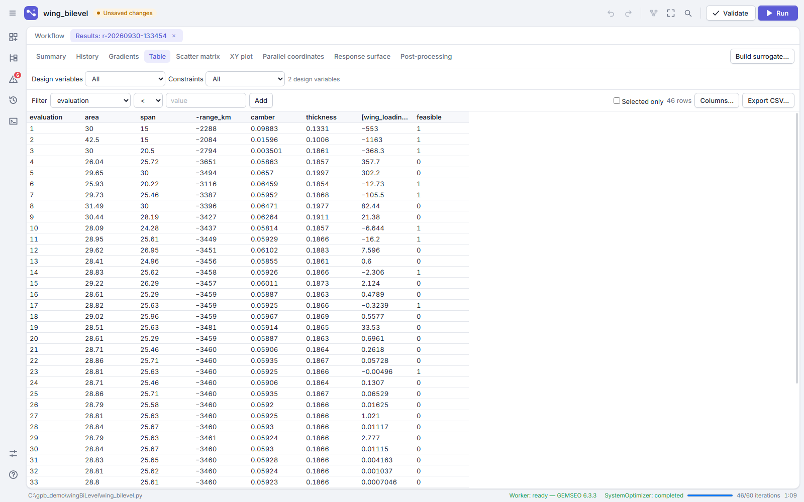

# User guide

GEMSEO Process Builder builds, runs and analyzes [GEMSEO](https://gemseo.readthedocs.io) processes graphically, in the spirit of Ansys ModelCenter. A model is a hierarchy of components (the computations), assemblies (groups of components) and drivers (MDA, DOE, optimization, parametric study). The application writes a readable GEMSEO script for it, runs it in a separate process, and shows the results.

- [Installing and starting](#installing-and-starting)
- [The window](#the-window)
- [Building a model](#building-a-model)
- [How variables are linked](#how-variables-are-linked)
- [Drivers](#drivers)
- [Checking a model](#checking-a-model)
- [Running](#running)
- [Results](#results)
- [External codes: executable wrappers](#external-codes-executable-wrappers)
- [Surrogate models](#surrogate-models)
- [Exports](#exports)
- [Files](#files)
- [Keyboard shortcuts](#keyboard-shortcuts)

## Installing and starting

The application needs Python 3.12 or 3.13, on Windows or Linux.

```bash
python -m pip install git+https://github.com/jcdulas/GemseoProcessBuilder.git
gemseo-process-builder              # or: python -m gemseo_process_builder
gemseo-process-builder model.py
```

The examples of the repository (`examples/`) are GEMSEO scripts, ready to open or to run with `python`: the Sellar problem with the MDF, IDF and DisciplinaryOpt formulations, a DOE and a parametric study of the Rosenbrock function, the Sobieski BiLevel optimization, a DOE around an optimization, a sequence around an optimization, a wing sizing, an external code, and, in `demoBiLevel/`, a bi-level optimization written by hand in several files, with functions and classes, and a component of every kind: analytic, Python function (with a renamed variable), Python class, external code and surrogate, in a chain and a parallel group; and, in `wingBiLevel/`, the wing sizing in bi-level, with files following the graph of the study and, for the aerodynamics and the structure, a normal model and a surrogate trained on it: the optimization runs on the surrogates, and its optimum is checked on the normal models, the surrogates learning more around it until they agree; and, in `wingBiLevel100k/`, the same wing in bi-level with 100,000 variables, optimized in about 30 s on exact gradients, the system level using the derivatives of the optima of the sub-optimizations (their sensitivities, from the Lagrange multipliers of their active sets).

User code and GEMSEO never run in the window itself: a background process (the *worker*) reads components and algorithms, and each run gets a process of its own (the *runner*). The status bar shows the state of the worker; **Tools › Restart worker** restarts it.

## The window


*The Library tab lists the components, containers and drivers; the Tree tab lists the nodes of the model.*


- **Top bar**:
  - the menu (☰) holds every command, with its shortcut, and the recent projects;
  - then the project, with its state (*Saved*, *Unsaved changes*, *Read-only*);
  - then undo and redo, auto-layout, fit, search, **Validate** and **Run** (**Stop** while a run is going).
- **Icon rail**, on the left, opens and closes the panels:
  - the *Nodes* to add (the library) and the *Tree* of the model;
  - the *Problems* of the model (the badge counts errors and warnings), the *Runs* and the *Console*;
  - at the bottom, the preferences and the keyboard shortcuts.
- **Center**: the *Workflow* canvas, and tabs opened on demand (N2, XDSM, results, editors).
- **Right**: the *Inspector* of the selected node or link (× hides it; View › Show inspector shows it again).

Short messages in the bottom-right corner tell how things went: project saved, model valid, run completed (with a button to open its results) or failed.

The canvas shows one level of the hierarchy at a time. Double-click an assembly or a driver to enter it; the breadcrumb in the top-left corner of the canvas goes back up. A container can also be expanded in place (context menu › Expand in place). The zoom buttons, the minimap, the search (Ctrl+F) and **Fit to view** (F) help on large levels.

Each level has a **start** (green circle) and an **end** (black circle):

- the start holds the inputs of the workflow, the values no node computes and no driver sets. Click it to see them and type their values: a value typed there goes to every node using the input;
- the end holds its results, the outputs no node uses. To show another output, drag its node onto the end, or choose it in the inspector of the end.

Nodes are drawn as **cards**: an icon colored by the type of node, the name, the kind and the number of inputs and outputs, with one link point on each side. While a model runs, the running nodes have a pulsing ring, and each node gets a green check when it is done. To see the variables on the node itself, use the context menu › Variables › Listed.

## Building a model


*A container, such as a driver, opens in place of the canvas; the breadcrumb at the top left goes back up. Here, inside an optimization driver, Model › SystemOptimizer.*


Drag items from the Library onto the canvas:

Every component not set up yet has a **Create an example** button in the inspector: it writes a working example of its kind (a wing whose area comes from its span and chord), asking where to save its files. Start from it and change it.

- **Analytic**: outputs written as formulas of the inputs, one per line (`y = x**2 + sin(z)`); the variables are found from the formulas. Start from an example; while typing, Tab completes the name of a variable of the other components (which couples them) or of a function. *Functions, operators and variables* lists what can be used: powers are written `x**2`, and names like `S`, `E`, `I`, `gamma` or `lambda` are reserved by SymPy.
- **Python function**: a function of a Python file; its arguments are the inputs and its returned variables the outputs.
- **Python class**: a GEMSEO discipline class of a Python file or of an installed module, with the arguments of its constructor. To write a new one, add a Python class and click **New Python file…** in the inspector:
  1. Name the class, and list its inputs and outputs. An input is a NumPy array: give its shape (`1`, `100000`, `3x4`), its type (float, int or complex) and its default value, one number filling the array or every element.
  2. Choose where to save the file. The application writes the class, and opens it in your code editor (Tools › Preferences › Code editor; Visual Studio Code when installed, as `code` or `vscode`).
  3. Write the computation in `_run`: read the inputs with `input_data["name"]`, and return the outputs in a dictionary.
  4. Save the file: the component follows it. Add or remove variables in the table of the inspector, which rewrites only their block of the class.
- **Executable wrapper**: an external program run through input and output files (see below).
- **Surrogate**: a surrogate model built from a DOE run of the project (see below).
- **Assembly**: a group of nodes. Its mode (inspector › Execution) decides how its content runs: `auto` (a chain, or an MDA when there are loops), `chain`, `parallel` or `mda`.
  - In a **chain**, the nodes run in the order shown by their numbers and the execution arrows. To change it, **drag the handle at the bottom of a node onto the node that must run right after it**. A node running before the results it uses is reported in the Problems.
  - A **parallel** block expanded in place shows a fork and a join around its branches.
  - In a group run automatically, the handle appears when the pointer is over a node: drawing an arrow turns the group into a chain. An optimizer can be a step of such a sequence, like any node: for instance material data, then the optimization, then the cost (see `examples/optimization_sequence.py`). The **Interface** tab of the optimizer lists what it takes from the sequence and gives back to it.
- **Drivers**: MDA, DOE, Optimization, Parametric study.

The **Demos** section of the Library lists the example studies: click one to open it. It is first copied to `Documents/GEMSEO Process Builder/demos/`, where you can change it and run it; clicking it again opens your copy.

Catalog folders (Tools › Preferences, or Model › Project settings for the project) add their Python functions, discipline classes and wrapper descriptors to the Library. They are scanned in the worker, never imported in the window.

The inspector edits the selected node: name, description, configuration (expressions, module, class, arguments…) and variables (unit, default value, description, global name). Variables are read again when the configuration changes.

Every change can be undone (Ctrl+Z); copy, paste, duplicate, group (Ctrl+G) and ungroup (Ctrl+Shift+G) work on the selection.

## How variables are linked

GEMSEO couples disciplines by variable name; ModelCenter by explicit links. The Process Builder does both:

- **By name**: within a driver (or the model), an output and an input with the same name are coupled. These links are grey.
- **Explicit links**: they couple an output to an input of another name. These links are dark.
  - Drag from the output point of a card onto another node. A panel lists the inputs of the target; choose, for each one, the output of the source feeding it.
  - Between nodes whose variables are listed, drag from an output port to an input port.
- An input has at most one producer; two outputs with the same name in the same scope are an error.
- **Isolate variable names** (context menu) prefixes the variables of a component or an assembly with its name, so that several copies can coexist. Only explicit links cross an isolated boundary.

There is one link per pair of nodes, with the number of variables it carries. **Click a link** to see its variables: the outputs of the source on the left, the inputs of the target on the right, with their units. From that panel, delete an explicit link, convert units, or link other variables.

Links that go backwards (loops) are drawn in their own color: an MDA solves them.

**Units** are pint units (`m`, `kg/s`, `degC`…). Coupled variables with compatible but different units are converted automatically (a warning says so, and the conversion can be switched off); incompatible units are an error.

**Arrays** of more than one dimension can be flattened to vectors when a driver or an MDA needs vectors (the port's 1-D option).

## GEMSEO scripts

**Open project…** also opens a GEMSEO script written by hand (`.py`). The application runs it until its study would start (nothing is computed), and builds the project from what it created: the disciplines, the MDA, the design space, the objective, the constraints and the algorithm. Values set on disciplines after they were built become values typed on their inputs. What cannot be kept (a discipline built from objects, for example) is listed. Save it as a project to keep its layout.

## Drivers


A driver (optimization, DOE, parametric study, MDA) is a container, like an assembly: at its level it is a card, and the nodes it drives are inside it. Double-click it to see them, or expand it in place (context menu › Expand in place). To put a node under the control of a driver, **drag from the driver onto the node** (or from the node onto the driver): the node moves into it.

Select a driver to edit it in the inspector, or double-click its name for a full-size editor. At its top, the **steps to set it up** say what is missing, with a button for each. For a DOE:

1. Put the components to evaluate inside it: *Choose a component…* lists the nodes next to it, *Open DOE* shows its inside, where components of the Library can be added.
2. Choose the variables to sample among the inputs of these components that no other component computes, and type their bounds.
3. Choose the responses: the outputs to record.
4. Check the sampling method (LHS by default) and its number of samples in the Algorithm tab.

- **Design variables**: only the free inputs of the driver (computed by no component) can be design variables. Bounds and initial values are given per element of a vector, or once for all of them.
- **Objectives** (minimize or maximize), **constraints** (`<=`, `>=`, `=`, with a value), **observables** or **responses**.
- **Algorithm**: the tab suggests an algorithm for the problem (number of design variables, constraints, whether the components give derivatives) and says why; a card explains the chosen one: what it does, when to use it, what it costs. *Compare all…* lists every algorithm by family (gradient-based, derivative-free, global, multi-objective…). Every installed GEMSEO algorithm (SciPy, and NLopt: MMA for many design variables with gradients, SLSQP, COBYLA, BOBYQA…), with a form generated from its settings. Algorithms that do not suit the problem (constraints, gradients, several objectives) are grayed out, with the reason.
- **Large-scale optimizer**: with the `gemseo-lso` plugin installed in the Python of the runs (`pip install -e plugins/gemseo_lso` from the repository), `LSO_MMA` and `LSO_GCMMA` appear among the algorithms, for 10⁵ to 10⁶ design variables and constraints: each iteration asks only for the gradients of the constraints close to activity. Their Algorithm tab has a **Colored Jacobians** option, unchecked by default: checked, it asks for the Python function of a project file that gives the sparsity pattern of the constraints — `pattern(variables, constraints)`, returning a `scipy.sparse` boolean matrix, constraints × variables; the optimizer then gets the gradients of the constraints far from activity from a few tens of directional derivatives, and computes those close to activity exactly. When a run cannot meet its constraints at the end, it brings itself back within them (smaller steps, GCMMA), and returns the best feasible point met. Piloted by Claude, these algorithms take its changes of settings at the next iteration without restarting, and the Copilot view charts their working set and the gradients they ask for at each iteration.
- **Formulation**: MDF, IDF, DisciplinaryOpt, BiLevel.
- **Execution**: number of processes, working folder, history, and the **fast mode**: GEMSEO no longer checks the data the disciplines exchange, which saves time at each evaluation with large arrays.

A variable can also be given a role from its context menu on the canvas (Set as design variable, objective, constraint).

**Nested drivers**: a driver inside another one becomes one of its disciplines. Its *Interface* tab picks the variables it receives and the ones it returns (for example a DOE around an optimization). The sub-optimizations of a BiLevel optimization need no interface.

## Checking a model


The model is checked continuously; the *Problems* panel lists errors, warnings and information, with quick fixes when one is obvious (switch to an MDA, remove a link, convert units…). **Validate** (F7) also builds the script and checks it in the worker (a *dry run*), without running it.

The **N2** view (View › N2 matrix) shows the couplings between the nodes of a level as a matrix, with feedback couplings in red; the **XDSM** view shows the process of a driver as GEMSEO describes it.

## Derivatives

Gradient-based algorithms (SLSQP, MMA…) need the derivatives of the model. GEMSEO assembles them from those of each component, through the couplings.

- Each component card says where its derivatives come from: **∂ exact** (computed by the component, like analytic expressions), **∂ approx.** (finite differences: external codes, functions without a Jacobian) or **∂ none** (a gradient-based algorithm cannot use it).
- **Check derivatives** (right click on a node) compares GEMSEO's derivatives with finite differences. On an optimizer, it differentiates the objective and constraints with respect to the design variables through the whole process, MDA included: a green matrix shows that the gradients go up through the couplings. The result shows on the card (✓ or ✗).

## Running


**Run** (F5) runs the selected driver, or the driver around the selection. The run starts in its own process, after a dry run. The canvas shows the state of each node, the status bar the progress, and the Console its logs; **Stop** (Shift+F5) stops it, and kills it if it does not stop in time.

Each run is kept in the data of the project (see [Files](#files)), with the script it ran, a copy of the project, its logs, its history and its results. The *Runs* panel lists them: open, rename, compare, export, delete.

## Results





A results tab opens for each run:

- **Summary**: status, duration, best point, feasibility.
- **Copilot**, for a run piloted by Claude (see [The Claude copilot](#the-claude-copilot)).
- **History**: objective, constraints and design variables along the iterations.
- **Gradients**: the size of the gradients of the objective and constraints the algorithm received at each iteration, and their last value by design variable.
- **Table**: every evaluation, sorted and filtered, exported to CSV.
- **Scatter matrix**, **XY plot**, **Parallel coordinates**, **Parametric** (curve, heat map, contours): selections are shared between the views.
- **Response surface**: the shape of a response over two design variables, predicted by a metamodel (Kriging, neural network…) learned from the evaluations, with the boundaries of the constraints and the infeasible regions hatched; in 2D or in 3D (drag to turn it). The R² below the toolbar tells how far the metamodel can be trusted.

With many design variables or constraints, the bar above the views chooses what they show: the variables the response is most sensitive to, those with the largest gradients, or those at a bound (the active set); and all the constraints or only the active and violated ones.
- **Post-processing**: GEMSEO's post-processings, with their settings, as images kept with the run.

Several runs can be compared (tick them in the Runs panel).

## The Claude copilot


An optimization or a DOE run on its own can be piloted by Claude: it watches the run, explains what happens and helps it converge, or places the samples where they matter. It needs the `gemseo-claude-pilot` package in the Python of the runs (the Copilot tab says how to install it) and a way to reach Claude, chosen in **Tools › Preferences › Claude copilot**:

- **Claude Code (subscription)**, the default: your own Claude Code, installed and logged in with your Claude account (run `claude` in a terminal once). The copilot uses none of its tools but its own, and no settings of yours.
- **API key**: an Anthropic API key, billed per token, kept in the keyring of your system (or read from `ANTHROPIC_API_KEY`).

*Check* tells whether Claude can be reached. **Models** chooses, in lists, the model of the regular checks, the model of events, the start and the end of a run, and the effort of every call: Claude Opus 5.5 at a low effort by default, which answers fastest and follows the run closely.

In the **Copilot** tab of the driver:

- **Pilot this optimization with Claude** (or this DOE): the first time, and whenever you choose to send more, you are asked to accept what is sent.
- **Mode**: *Observer* (Claude explains, changes nothing), *Advisor* (Claude proposes, you accept or reject), *Pilot* (Claude applies its decisions).
- **Claude may**: for an optimization, change the algorithm settings, narrow the design space, switch algorithm, stop the run, and for a bi-level one, retune a sub-optimization (its algorithm or settings, from the next system iteration); for a DOE, add samples, possibly in a sub-region, or stop the run. Whatever it decides, it never widens your bounds nor spends more evaluations than the maximum of iterations, or than the samples you asked for.
- **A piloted DOE** draws half of its samples as you set them, then Claude places the others; those it leaves are drawn at the end, as you asked. This needs a number of samples and a method with a seed (LHS, Monte Carlo, Sobol, Halton…); otherwise the DOE draws all its samples at once and Claude only comments on them.
- **Surrogates**: Claude is told how each surrogate component was trained (model, number of samples, R² on its training data), and says when a result relies on one it should not trust.
- **Data sent**: *Anonymized*, *Without code* (the default) or *Full*.
- **Calls per run**.

A piloted run has a **Copilot** view in its results: what Claude said, its proposals with **Accept** and **Reject** while the run goes on, the mode (which can be changed during the run), the calls and tokens spent, and the segments of the run; each change of algorithm or settings is marked on the History charts. The generated script runs the optimization through `ClaudePilot` in a few lines, and runs the same way outside the application.

Talking with the copilot:

- **Review with Claude**, in the Copilot tab: Claude reads the problem before it runs (bounds, starting point, constraints, algorithm, budget) and says what to change.
- **Questions**, in the Copilot view: during the run, Claude answers at the next iteration; after it, from the history of the run. The answers stay in the journal of the run.
- **Report**: at the end of a piloted run, Claude writes a short analysis (what happened, how much to trust the result, what to try next), shown in the Copilot view and offered in *Export report*.

A model whose design lies on a grid, such as a topology optimization, can describe its physics to the copilot: a discipline with the methods `physical_description()` (the problem in words, the grid, the design variable and the constraints on it, the supports, the loads, the geometric features, the fields and how to read them) and `physical_fields(input_data)` (those fields at a point). Claude then reads the design as an engineer would: maps of the density and of the stresses, whether the material carries the loads to the supports, thin members, gray and dead material, stress hot spots and the feature they sit at. At each call it sees where the design is heading, and can steer it there to reach the optimum in fewer iterations — extrapolating the trend, filling or emptying regions, setting values — the large-scale optimizer going on from the steered design without restarting; after the first iteration it judges whether the run started from a viable point. When the run is stuck, it can restart it from another design: a past one, with a region filled or emptied, a corner rounded, a bar added to close a load path. At most three restarts per run; the report ends with the maps of the final design and of each restart. The stress-constrained benchmark of `gemseo-lso` is an example.

## External codes: executable wrappers

An executable wrapper runs a program through files: it writes the input files from templates, runs the command, and reads the outputs. **Tools › New executable wrapper**, or **Open wrapper editor** in the inspector of an Executable component, opens the editor:

1. **Command**: the command line (`{input_file}`, `{output_file}`, `{workdir}`, `{python}`), environment variables, timeout, success codes, error patterns, where working folders go and which ones are kept, files to copy.
2. **Inputs**: load a sample input file, select a value (or a vector) and choose **Make variable**. The value becomes a `{{name:format}}` marker, the format guessed from the text (`.6e`, `12.4f`…), and the input is declared with the value as default.
3. **Outputs**: load a sample output file (or use the standard output of a test run) and select a value. The rules that read it are suggested and previewed on the sample (a key, a marker line and a column, a regular expression, a table).
4. **Test run**: run the wrapper once with chosen values, and see the outputs, the command, its return code, its output and its working folder.

**Apply to component** gives the wrapper to the component; **Save as descriptor** writes a reusable `.gpbwrap.json` file (put it in a catalog folder to find it in the Library).

## Surrogate models

A surrogate replaces a costly computation by a regression model trained on a DOE run. Open **Build surrogate** from the Runs panel, the results tab of a run, or the inspector of a Surrogate component:

1. **Data**: the run, and the inputs and outputs to learn.
2. **Algorithm**: a GEMSEO regression model (RBF, Gaussian process, polynomial…) and its settings, and the number of folds of the cross-validation.
3. **Training and quality**: R² and RMSE on the training data and by cross-validation, the predicted values against the observed ones, and the residuals.
4. **Save**: surrogates are kept in the data of the project (see [Files](#files)), and Surrogate components use them. They can be retrained later; they stay usable if their run is deleted. A surrogate is saved as its training samples (an HDF5 file) with its settings, and trained again when it is used, in a fraction of a second: nothing is pickled, so antivirus software has nothing to quarantine. Surrogates saved by earlier versions are pickles: they still work, and training one again replaces its pickle.

## Exports

- **File › Export Python script**: the GEMSEO script of the model or of a driver, readable and runnable on its own.
- **File › Export image**: the canvas (the level shown, or the whole model), the N2, the XDSM or a chart, as SVG or PNG (1×, 2×, 4×). Charts also have **Export image** in their context menu.
- **File › Export report**: a standalone HTML file, or a PDF, with the description of the project, its diagrams, its components and variables, its problems, and chosen runs and post-processings.
- The XDSM view exports a standalone HTML page, and a PDF when pyXDSM and LaTeX are installed.

## Files

- `<name>.py`: the project, a GEMSEO script. It runs on its own with `python <name>.py`, and opens again in the application, which reads it and lays the diagram out. Nothing else is saved: positions, and units or descriptions typed on variables, are not kept. You can edit the script: the application rewrites only its own functions (`build_disciplines`, `build_scenario`…) and keeps your functions, classes and statements. The first time a script written by hand is saved, its original is kept as `<name>.original.py`.
- A study not complete yet (an empty model, a driver without objective) cannot be written as a script: the save says why, and the project stays in its autosave until it can be written.
- Opening a script checks first, without running it, that it is a GEMSEO 6 study: a study written for GEMSEO 5 or earlier, or another program, is refused, with the lines to change (for instance `MDODiscipline`, now `Discipline`). The modules of the folder it imports are checked too.
- `<name>.gpb.json`: a project of an older version. It still opens; *Save* writes it as a script.

Nothing else is written next to the script. The rest of the project is kept out of sight, in the data folder of the application in your user profile (on Windows, under `%APPDATA%`), in `projects/<name>-<key>/`:

- the runs and the surrogate models, found again when the script is opened;
- the autosave: unsaved changes, written regularly and offered for recovery after a crash;
- the lock, written while a project is open: another window opening the same project opens it **read-only**; save it under another name to keep changes.

*Save as…* takes the runs and surrogates along. A script moved or renamed outside the application finds them again when it is opened: it is recognized by its content, or, if it was edited since, by its model (the same nodes with the same names). When several moved projects could be it, you choose the right one from where each was, with its numbers of runs and surrogates. Runs and surrogates that older versions kept next to the project file are moved there when the project is opened.

Files next to the script (a wrapped executable, a Python module) are found from the script itself (`Path(__file__).parent`), so a project folder can be moved or shared.

## Keyboard shortcuts

| Action | Shortcut |
|---|---|
| New, open, save, save as | Ctrl+N, Ctrl+O, Ctrl+S, Ctrl+Shift+S |
| Undo, redo | Ctrl+Z, Ctrl+Y (or Ctrl+Shift+Z) |
| Cut, copy, paste, duplicate | Ctrl+X, Ctrl+C, Ctrl+V, Ctrl+D |
| Delete, rename, select all | Delete, F2, Ctrl+A |
| Find | Ctrl+F |
| Fit to view, auto-layout | F, Ctrl+L |
| Go up one level | Alt+Up, Backspace |
| Validate | F7 |
| Group, ungroup | Ctrl+G, Ctrl+Shift+G |
| Run, stop | F5, Shift+F5 |

Help › Keyboard shortcuts lists them in the application. Space + drag pans the canvas; the mouse wheel zooms.
