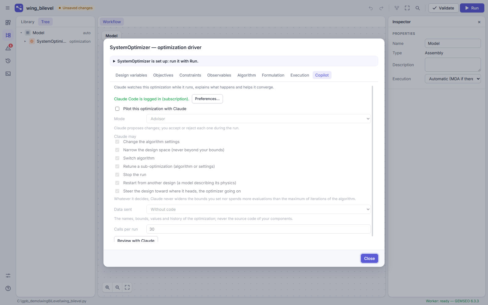
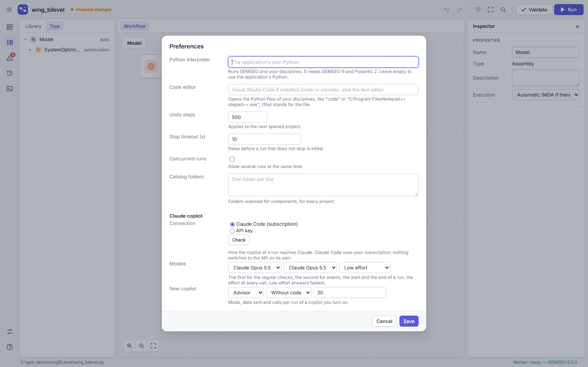

# GEMSEO Claude Pilot

A copilot that watches GEMSEO optimizations and DOEs while they run, and adjusts their strategy with Claude: algorithm settings, design space, algorithm choice, early stop. It is specified in [docs/CLAUDE_PILOT_SPEC.md](../../docs/CLAUDE_PILOT_SPEC.md).

Work in progress: this version holds the parts that need no network (decisions, guardrails, detectors, the context sent to Claude and its data levels) and a fake backend for tests. The pilot itself and the real backends come next.

A discipline whose design lies on a grid can describe its physics (`physical_description()`, `physical_fields()`, spec § 4.8): Claude then reads maps and physical indicators of the design (load path, members, gray and dead material, stress hot spots) and may restart the run from a transformed design.

In GEMSEO Process Builder, the copilot is turned on in the Copilot tab of a driver, and its connection and models are chosen in the preferences:

| The Copilot tab of a driver | The preferences of the copilot |
|---|---|
|  |  |

It is not published on PyPI. Install it from the repository:

```
pip install "gemseo-claude-pilot @ git+https://github.com/jcdulas/GemseoProcessBuilder.git#subdirectory=plugins/gemseo_claude_pilot"
```

or, in a clone, `pip install -e plugins/gemseo_claude_pilot`.

MIT license.
