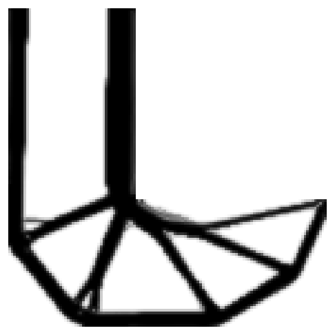
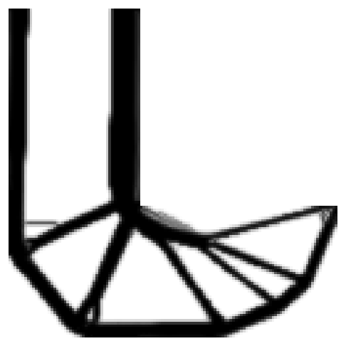

# gemseo-lso

A gradient-based optimizer for large problems — 10⁵ to 10⁶ design variables and as many inequality constraints — whose constraint gradients are costly: MMA and GCMMA (Svanberg, 1987 and 2002), written in Python with NumPy, SciPy and Numba, running one iteration at a time, its state saved and restored exactly, its settings changed between two iterations without a restart.

Specified in [docs/LARGE_SCALE_OPTIMIZER_SPEC.md](../../docs/LARGE_SCALE_OPTIMIZER_SPEC.md). MIT licence.

Each iteration asks only for the rows of the constraints close to activity (the working set), checks the step against the values of all the constraints, and solves the subproblem again when a screened-out constraint would be violated. Rows can be dense or sparse (`scipy.sparse`); a few equality constraints are supported.

Status: the core, the working set, the colored Jacobians and the GEMSEO algorithms `LSO_MMA` and `LSO_GCMMA` (plans 65 to 68). The benchmarks on topology optimization (plan 69) and the piloting by Claude (plan 70) follow.

**It adjusts itself.** MMA switches to GCMMA when it cycles (its residual not decreasing while its iterates still move); the subproblems are solved coarsely while the iterates move far and finely as they settle; a run that cannot reach `kkt_tolerance` stops with the status `stalled` and the precision it reached, instead of running to `max_iter`. MMA suits structural problems (compliance, stresses); GCMMA can be asked for from the start for the others.

**Speed.** The subproblems are solved in their dual, by a projected Newton method when the rows are sparse; the loops over the variables are parallel Numba kernels, compiled on first use (a few seconds, once: they are cached on disk). At 10⁶ variables and constraints, an iteration of the optimizer takes about 12 s on 12 cores.

On the stress-constrained L-shaped bracket of the benchmarks (10⁴ elements), the working set reaches the design of the run that asks for every constraint row with about a quarter of the rows:

| With the working set (482,288 rows) | With every row (2,000,000 rows) |
|---|---|
|  |  |

## Installation

From the repository, never from PyPI:

```bash
pip install -e plugins/gemseo_lso
```

## In GEMSEO

Installed, the package adds two GEMSEO algorithms, `LSO_MMA` and `LSO_GCMMA`, listed in GEMSEO Process Builder with the others:

```python
scenario.execute(algo_name="LSO_GCMMA", max_iter=200, kkt_tolerance=1e-3)
```

GEMSEO's stopping criteria apply (`max_iter` counts evaluations); `store_jacobian` is always False. The gradients of the constraints come, for each inequality constraint:

- **in full** from GEMSEO (`constraint.jac`, dense or sparse), by default: right for small problems and for sparse explicit constraints;
- **row by row** when the discipline computing the constraint offers them (`RowJacobian`): only the rows of the working set are asked for, in one batch per iteration.

```python
class Structure(Discipline):
    ...

    def compute_jacobian_rows(self, output_name, rows, input_data):
        """The gradients of the components ``rows`` of an output, by input name."""
        return {"thickness": self.solver.stress_gradients(rows, input_data)}
```

The inputs of the discipline are design variables, or outputs of disciplines run before it without a coupling (their Jacobians are chained). A discipline coupled with others in an MDA is refused in this mode.

**Colored Jacobians** (below) through GEMSEO: `jacobian_mode="hybrid"` with `sparsity_pattern`, a function `pattern(variables, constraints)` receiving the design variables and the inequality constraints as `(name, size)` in GEMSEO's order and returning a `scipy.sparse` boolean matrix. A discipline offering `compute_directional_derivatives(output_name, directions, input_data)` (`TangentJacobian`) gives the products of the Jacobian of an output with directions given by input name; otherwise, finite differences on the values.

## Use of the core

A problem gives the values of the objective and of all the constraints at a point, the gradient of the objective, and the gradients of the constraints it is asked for (rows of the Jacobian), in one batch:

```python
import numpy as np

from gemseo_lso import DenseProblem, Optimizer, Settings

problem = DenseProblem(
    x0=np.full(5, 5.0),
    lower=np.full(5, 1.0),
    upper=np.full(5, 10.0),
    objective=lambda x: float(0.0624 * x.sum()),
    objective_gradient=lambda x: np.full(5, 0.0624),
    constraints=lambda x: np.array([np.sum([61, 37, 19, 7, 1] / x**3) - 1]),
    constraint_jacobian=lambda x: (-3 * np.array([61, 37, 19, 7, 1]) / x**4)[None],
)
result = Optimizer(problem, Settings(method="gcmma")).run()
```

For a problem of your own, implement the protocol `LargeScaleProblem` (`x0`, `lower`, `upper`, `values`, `objective_gradient`, `constraint_rows`, `equality_rows`). `gemseo_lso.benchmarks.synthetic.LocalConstraints` is an example at any size, with a known solution; `benchmarks/run_synthetic.py` measures the optimizer on it.

Step by step:

```python
from dataclasses import replace

optimizer = Optimizer(problem)
for report in optimizer:  # one outer iteration per step
    print(report.iteration, report.objective, report.max_constraint)
    if report.iteration == 10:
        optimizer.settings = replace(optimizer.settings, move_limit=0.1)
# Resumed later by Optimizer(problem, state=State.load("state.h5")).
optimizer.state.save("state.h5")
```

## Settings

| Setting | Default | |
|---|---|---|
| `method` | `mma` | `gcmma`: conservative inner iterations, globally convergent; MMA switches to it when it cycles |
| `kkt_stall_iterations` | 10 | Iterations without progress before MMA switches to GCMMA (iterates moving) or the run stops as `stalled` (iterates settled) |
| `max_iter` | 1000 | Outer iterations |
| `kkt_tolerance`, `ineq_tolerance` | 1e-3, 1e-5 | Convergence: KKT residual relative to the size of the gradient, and feasibility |
| `ftol_rel`, `xtol_rel`, `stall_iterations` | 0, 0, 3 | Stop when the objective or the point hardly changes (0: never) |
| `asymptote_init`, `asymptote_increase`, `asymptote_decrease` | 0.5, 1.2, 0.7 | The moving asymptotes |
| `move_limit` | 0.5 | Largest move per iteration, as a fraction of the ranges |
| `elastic_cost`, `elastic_quadratic` | 1000, 1 | The elastic variables keeping the subproblems feasible |
| `dual_solver`, `dense_dual_threshold`, `dual_tolerance` | `auto`, 100, 1e-5 | A primal-dual interior point up to 100 constraints, then a projected Newton method on the dual with sparse rows, L-BFGS-B with dense ones; each subproblem solved to a tenth of the last step, at least `dual_tolerance` and a tenth of the feasibility tolerances |
| `max_inner_iterations` | 20 | GCMMA inner iterations per outer iteration |
| `screening_margin`, `screening_margin_min`, `keep_factor` | 0.3, 0.05, 1.5 | The working set: constraints within the margin (twice the last change of the constraints, between the two bounds) of activity, the active ones, and those of the last working set within `keep_factor` times the margin; each constraint divided by its largest change when one variable crosses its range, whatever its units |
| `max_working_set`, `max_screening_repairs` | 20,000, 3 | Rows per iteration; subproblems solved again when a step violates a screened-out constraint |
| `violated_share`, `violated_working_set` | 0.25, 0.1 | Outside the feasible domain (more than this share of the constraints violated), the working set holds this share of the constraints, the most violated first (1: never outside) |
| `row_refresh`, `fresh_margin`, `max_row_age`, `max_row_step` | `always`, 0.05, 3, 0.05 | `near_active`: reuse the rows of constraints farther than `fresh_margin` from activity, younger than `max_row_age` iterations, while the point moved less than `max_row_step` |
| `row_batch_size` | 0 | Rows per request (0: all at once) |
| `row_dtype` | `float64` | The precision of the rows: float32 halves their memory and the time of the products, but rounds the subproblem too much to meet the finest tolerances |
| `eq_tolerance`, `equality_band_decrease`, `max_equality` | 1e-5, 0.5, 100 | Equality constraints, as pairs of inequalities whose band shrinks to `eq_tolerance` |
| `jacobian_mode` | `rows` | `hybrid`: the colored Jacobians below, only when asked for |
| `descent_iterations` | 0 | The path through the constraints: a descent of at most this many iterations from the start, with soft constraints, before the restoration and the normal iterations (0: off) |
| `restoration_iterations` | 20 | Iterations spent, at most, bringing an infeasible run back within the constraints (0: never) |
| `max_row_evaluations` | 0 | A budget of constraint gradients: the run stops with the status `max_rows` (0: none) |
| `pattern_margin`, `color_overlap` | 1, 2 | Widenings of the pattern before the first coloring; colorings, each on the pattern widened once more |
| `leakage_tolerance` | 0.01 | `hybrid`: exact rows for the constraints whose colored row leaks more than this share of its norm |
| `jacobian_refresh`, `difference_step` | 1, 1e-6 | Iterations between two colorings (Schubert's update in between); step of the finite differences without a tangent mode |

## Colored Jacobians (optional)

Off by default. When each constraint depends on a few neighbouring variables (large surfaces: hulls, car bodies, wings), the gradients of the constraints far from activity cost a few tens of directional derivatives instead of one gradient each. The problem gives its pattern — `sparsity()`, a `scipy.sparse` boolean matrix (constraints × variables) — and, if it can, its tangent mode — `directional_derivatives(x, directions)`, the products of the Jacobian with a sparse `(n, k)` matrix of directions; without it, finite differences on the values. Then:

`jacobian_mode="hybrid"` takes the exact rows of the constraints near activity, and of those whose colored row leaks, the others from the colored Jacobian: the optimum is the problem's, since only the constraints near activity have multipliers. (Taking every row from the colored Jacobian was removed: its optimum is that of the colored Jacobian, off wherever the constraints are not local.) Stresses computed from the displacements of a whole structure are not local: on the stress-constrained bracket, a third of each stress row lies outside a pattern of one element, and `hybrid` saves nothing.

`probe_sparsity(problem, x, rows)` compares a few exact rows with the colored Jacobian at a point: the share of each row outside the pattern, the error of its colored entries and the error the colorings estimate.

## Piloting and resuming

While `LSO_MMA` or `LSO_GCMMA` runs, `gemseo_lso.gemseo.live.live_run(problem)` gives its live run: the report of each outer iteration (`reports`, `watch(listener)`), settings changed at the next outer iteration without a restart (`change({...})`), a switch between MMA and GCMMA (`switch("gcmma")`), a stop and a saved state (`stop()`, `save(path)`), the multipliers of each constraint and the stationarity of each design variable at the last iteration (`multipliers()`, `stationarity()`), a move of the design the optimizer goes on from, its state kept (`move(x)`). The Claude copilot (`gemseo-claude-pilot`) uses it. The stress-constrained topology benchmark describes its physics to the copilot (`physical_description()`, `physical_fields()`): the copilot reads maps of its design and may restart it from a transformed one. `save_state="state.h5"` saves the state at the end of a run; `resume_from="state.h5"` goes on from it.

## Feasibility

MMA is not feasible at each iterate. When a run's objective has settled while it is still outside its constraints, or near `max_iter`, the optimizer brings it back within them: GCMMA, a move limit halved at each iteration, a higher cost of the elastic variables and the dual solved to its finest tolerance, for at most `restoration_iterations` iterations. The result is the best feasible point met when the last one is not feasible.

## Costs

The optimizer keeps the rows of the constraints and their absolute values: 2 × 8 bytes per row entry in float64 (10⁴ rows of 10⁵ variables: 16 GB; half in float32). One evaluation of the dual of the subproblem is four products with them. Measured on 12 cores, for 10⁵ variables: a subproblem of 2,000 constraints solved in 3.5 s, of 5,000 in 8.2 s (about 20 dual evaluations); a nearly infeasible subproblem, with hundreds of violated constraints, takes much longer (about 1,400 evaluations).
